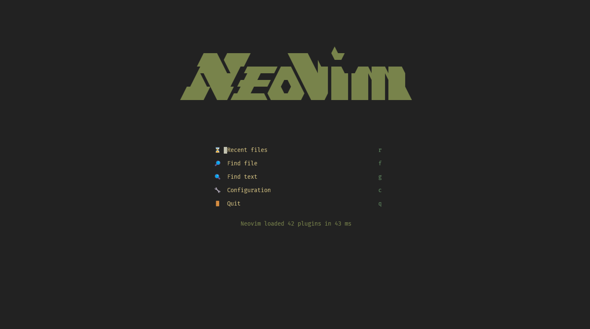
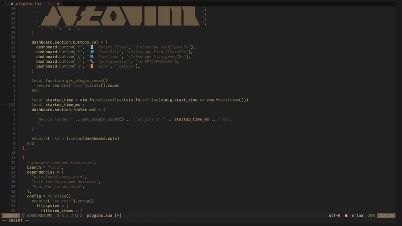
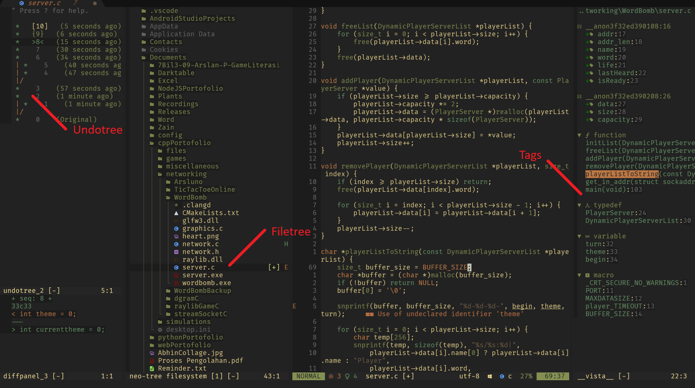
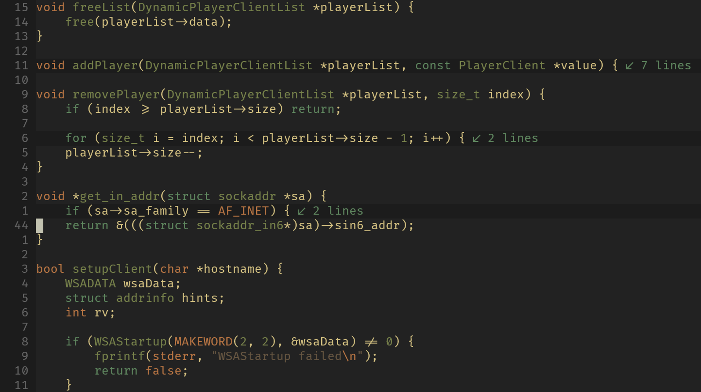
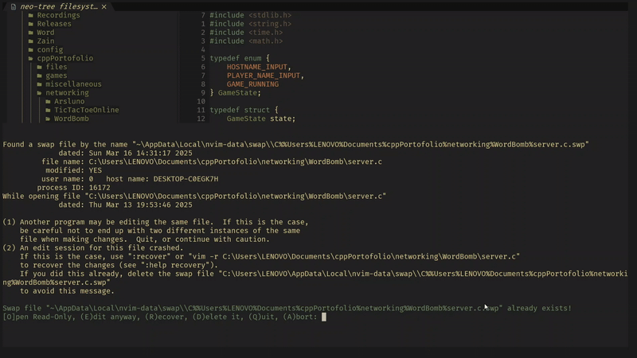
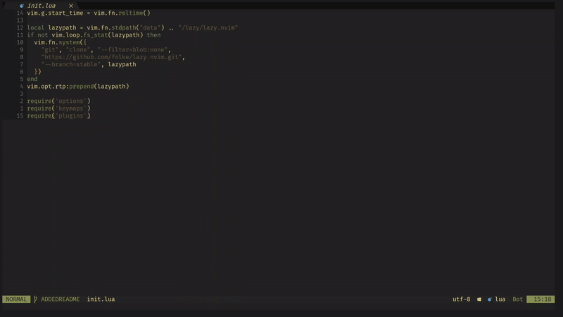

# Arslan's Neovim Config
<p>
    <a>
      
    </a>
    <a>
      
    </a>
    <a>
      
    </a>
    <a href="https://github.com/neovim/neovim/releases/tag/stable">
      
    </a>
    <a>
      
    </a>
</p>
This repo contains my Neovim configuration for Linux, MacOS, and Windows.

## Screenshot

<p align="center">
    
</p>

## Installation

### 1. Backup existing config
```shell
# On Linux/MacOS
mv ~/.config/nvim ~/.config/nvim.backup

# On Windows
move $HOME\AppData\Local\nvim $HOME\AppData\Local\nvim-backup
```

### 2. Clone the repository
```shell
# On Linux/MacOS
git clone https://github.com/ttys3/nvim-config.git $HOME/.config/nvim

# On Windows
git clone https://github.com/ttys3/nvim-config.git $HOME\AppData\Local\nvim
```

## Requirements

- Neovim v0.9+
- Nerd fonts (optional)
- Make & GCC/Clang
- Yarn/npm
- Ripgrep

## Demonstration

<table>
    <tr>
        <td align="center"><strong>Start screen with alpha-nvim</strong><br>
            
        </td>
        <td align="center"><strong>Autocompletion using nvim-cmp</strong><br>
            
        </td>
    </tr>
    <tr>
        <td align="center"><strong>Undotree, neo-tree.nvim, and vista.vim</strong><br>
            
        </td>
        <td align="center"><strong>Folding using nvim-ufo</strong><br>
            
        </td>
    </tr>
    <tr>
        <td align="center"><strong>GUI notification using nvim-notify</strong><br>
            
        </td>
        <td align="center"><strong>Wildmenu autocompletion using wilder.nvim</strong><br>
            
        </td>
    </tr>
</table>

<p style="text-align: center; margin-top: 30px;">To see more demonstrations, check <a href="https://github.com/arslanarkananta/nvim-config/issues/7">here</a></p>

## Features

+ Package management via [Lazy.nvim](https://github.com/folke/lazy.nvim).  
+ Git integration, commands, and signs via [gitsigns.nvim](https://github.com/lewis6991/gitsigns.nvim) and [vim-fugitive](https://github.com/tpope/vim-fugitive).  
+ Statusline via [lualine.nvim](https://github.com/nvim-lualine/lualine.nvim).  
+ Tabs and buffers management via [bufferline.nvim](https://github.com/akinsho/bufferline.nvim).  
+ File explorer via [neo-tree.nvim](https://github.com/nvim-neo-tree/neo-tree.nvim).  
+ Startup screen via [alpha-nvim](https://github.com/goolord/alpha-nvim).  
+ Fuzzy finder via [telescope.nvim](https://github.com/nvim-telescope/telescope.nvim) and [telescope-fzf-native.nvim](https://github.com/nvim-telescope/telescope-fzf-native.nvim).  
+ Language Server Protocol (LSP) support via [nvim-lspconfig](https://github.com/neovim/nvim-lspconfig) and [mason.nvim](https://github.com/williamboman/mason.nvim).  
+ Autocompletion via [nvim-cmp](https://github.com/hrsh7th/nvim-cmp), [cmp-nvim-lsp](https://github.com/hrsh7th/cmp-nvim-lsp), [cmp-buffer](https://github.com/hrsh7th/cmp-buffer), and [cmp-path](https://github.com/hrsh7th/cmp-path).  
+ Snippet support via [ultisnips](https://github.com/SirVer/ultisnips) (preferred) and [friendly-snippets](https://github.com/rafamadriz/friendly-snippets).  
+ Syntax highlighting via [nvim-treesitter](https://github.com/nvim-treesitter/nvim-treesitter).  
+ Auto pairs for brackets, parentheses, and quotes via [nvim-autopairs](https://github.com/windwp/nvim-autopairs).  
+ Enhanced commenting via [Comment.nvim](https://github.com/numToStr/Comment.nvim).  
+ Better escape from insert mode via [better-escape.nvim](https://github.com/max397574/better-escape.nvim).  
+ Tag explorer via [vista.vim](https://github.com/liuchengxu/vista.vim).  
+ Code indexing via [vim-gutentags](https://github.com/ludovicchabant/vim-gutentags).  
+ Code formatting via [conform.nvim](https://github.com/stevearc/conform.nvim).  
+ Undo history via [undotree](https://github.com/mbbill/undotree).  
+ Folding enhancements via [nvim-ufo](https://github.com/kevinhwang91/nvim-ufo).  
+ Better navigation via [hop.nvim](https://github.com/phaazon/hop.nvim).  
+ Better wildmenu completion via [wilder.nvim](https://github.com/gelguy/wilder.nvim).  
+ Whitespace management via [vim-better-whitespace](https://github.com/ntpeters/vim-better-whitespace).  
+ Markdown support via [vim-markdown](https://github.com/preservim/vim-markdown) and [markdown-preview.nvim](https://github.com/iamcco/markdown-preview.nvim).  
+ TODO highlighting via [todo-comments.nvim](https://github.com/folke/todo-comments.nvim).  
+ Bulleted lists support via [bullets.vim](https://github.com/dkarter/bullets.vim).  
+ GUI notifications via [nvim-notify](https://github.com/rcarriga/nvim-notify).  
+ Which-key popup for keybindings via [which-key.nvim](https://github.com/folke/which-key.nvim).  
+ Indentation guides via [indent-blankline.nvim](https://github.com/lukas-reineke/indent-blankline.nvim).  
+ Session persistence via [persistence.nvim](https://github.com/folke/persistence.nvim).  
+ Yank and put enhancements via [yanky.nvim](https://github.com/gbprod/yanky.nvim).

## Contributing

#### *Did you find a bug?*
+ Any issues regarding the config should be reported in [issues](https://github.com/arslanarkananta/nvim-config/issues). 
+ Make sure the bug was not already reported by searching in our issues page.

#### *Did you write an improvement?*
Please send a [GitHub Pull Request](https://github.com/arslanarkananta/nvim-config/pull/new/master) with a clear list of what you've done (read more about [pull requests](http://help.github.com/pull-requests/)). 
Make sure all of your commits are atomic (one feature per commit). Always write a clear log message for your commits. One-line messages are fine for small changes, but bigger changes should look like this:
``` cmd
    $ git commit -m "A brief summary of the commit
    > 
    > A paragraph describing what changed and its impact."
```
